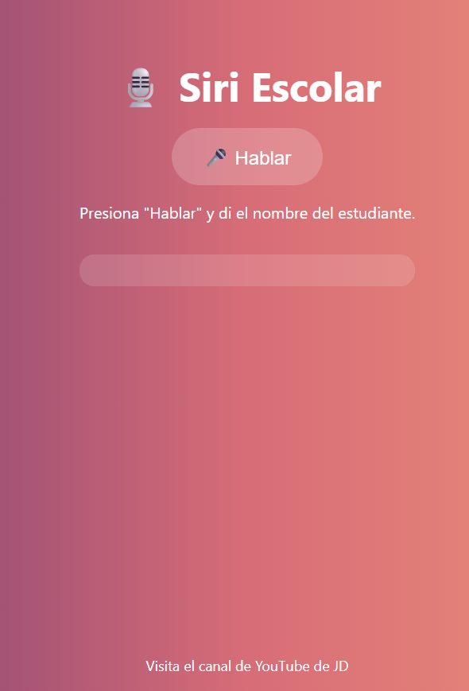

# 🤖 Siri Escolar – Promo 6to BF 🧠🎓

**SiriBF6to** es una versión escolar del famoso asistente Siri, pero con un toque ácido, humorístico y 100% personalizado para los estudiantes.  
Aquí no hay IA, pero sí mucha *inteligencia afilada* disfrazada de sarcasmo académico.

Cada estudiante (y hasta el profe) tiene su perfil con descripciones tan brutales como certeras. Ideal para reír, identificarse y recordar esos momentos únicos que solo pasan en una promo con mucho bug... y mucho corazón.

---

### 🎯 ¿Qué incluye este proyecto?
- ✅ Perfiles de estudiantes con nombre completo y descripción al estilo "falso Siri".
- ✅ Un perfil especial del profesor... porque sí, nadie se salva.
- ✅ Todo en formato JavaScript, simple y editable para futuras generaciones o promos vengativas.
- ✅ Diseño visual personalizado para proyectarse en eventos, ferias o solo para morir de risa en clase.

---

### 📹 Mira el proyecto en acción
🎥 Visita el canal oficial en YouTube:  
👉 [@jdav777](https://www.youtube.com/@jdav777)
